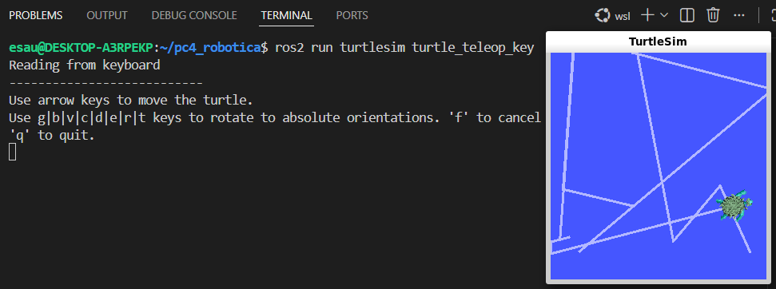
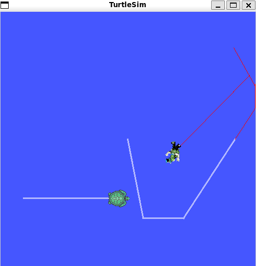
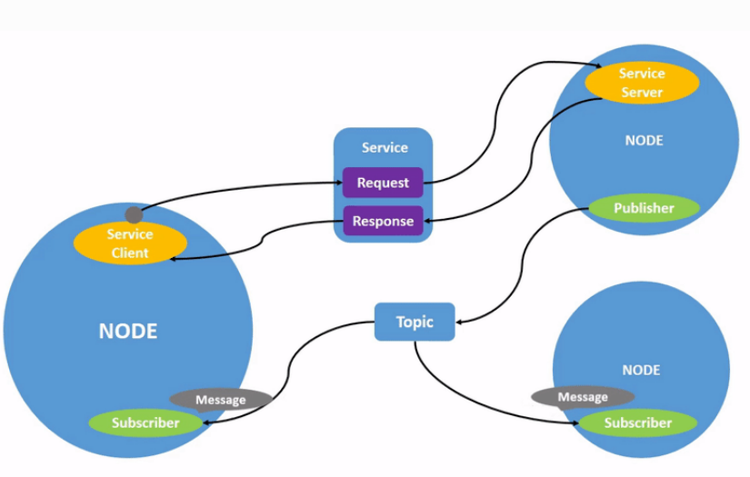
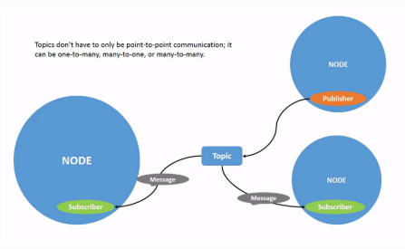
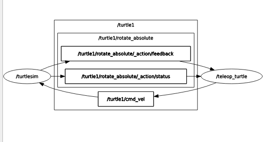
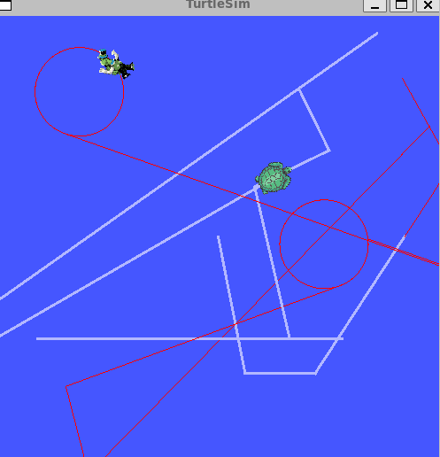
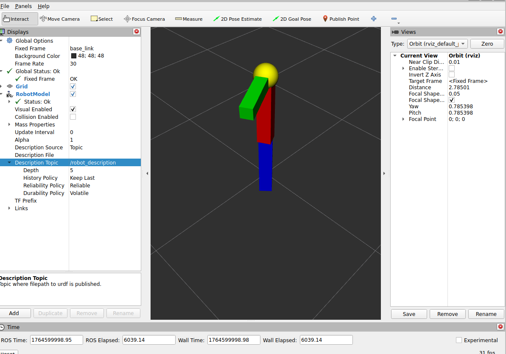

# PC4 BRAZO ROBOTICO 


seguir la guia de instalacion 

https://docs.ros.org/en/kilted/Installation/Alternatives/Ubuntu-Development-Setup.html

## PRIMEROS COMANDOS
```bash 
# importante
esau@DESKTOP-A3RPEKP:~$ source /opt/ros/kilted/setup.sh
```
Obtenemos el script bash desde esa ruta y lo activamos (ejecutamos) , de modo que importamos las variables PATH, LD_LIBRARY_PATH, PYTHONPATH,ROS_DISTRO al shell (terminal) actual donde se ejecuta , luego las librerias y paquetes de ROS2 se ejecutaran correctamente en el terminal actual, hace estas entre otras exportaciones
```bash
export ROS_DISTRO=kilted
export PATH=/opt/ros/kilted/bin:$PATH
```

Se realiza una prueba rapida para ver el mecanismo piblisher - suscriptor 
```bash
ros2 run demo_nodes_cpp talker
[INFO] [1764453104.711036905] [talker]: Publishing: 'Hello World: 3030'
[INFO] [1764453109.265536838] [talker]: Publishing: 'Hello World: 3031'
....
ros2 run demo_nodes_py listener
[INFO] [1764453104.712581219] [listener]: I heard: [Hello World: 3030]
[INFO] [1764453109.266554404] [listener]: I heard: [Hello World: 3031]
```
### turtlesim
Seguir los pasos de instalacion
```bash
sudo apt install ros-kilted-turtlesim
# ros2 <verbo-principal> <subcomando> [argumentos] [opciones]
ros2 pkg executables turtlesim
```
A sabe **ros2** es el ejecutable principal , **pkg** es el comando de alto nivel(grupo de operaciones) para trabajar con paquetes equivalente a un **namespace** pues CLI esta organizado jerarquicamente 
```bash
ros2
 └── pkg
      ├── list
      ├── executables
      ├── prefix
      ├── xml
      └── create
# se obtiene la lista de funciones del modulo
turtlesim turtle_teleop_key
turtlesim turtlesim_node
...
```
en tanto que el subcomando **executable** y **turtlesim** indiacan la operacion y el argumento posicional(paquete). OSea ejecutamos el paquete turtlesim via ros2 pkg executable.<br>
Ahora 
```bash
# ros2 comando_principal paquete ejecutable
# llamamos a las funciones listadas antes
ros2 run turtlesim turtlesim_node
# en otro terminal
ros2 run turtlesim turtle_teleop_key
```
El primero crea el nodo donde se encuentra la tortuga y el otro manipula sus movimientos


Se esta trabajando en **wsl**, debido a que QT(la libreria que dibuja la ventana de turtlesim) espera que **/run/user/1000**  tenga permisos 0700 solo el usuario puede acceder, pero en wsl tenemos 0755 todos pueden leer/ejecutar, con **sudo chmod 700 /run/user/1000** remediamos eso.

Como bien indica el tutorial al ejecutar **ros2 run turtlesim turtle_teleop_key** en un nueva terminal se crea un nodo desde donde controlamos a la tortuga en el nodo ejecutado antes, con las flechas es posible hacer mover a la tortuga en la ventana QT
<p align="center">
    
</p>

### qrt
Se sigue luego las indicaciones para la instalacion de **rqt**, un framework grafico modular para manipular y visualizar los componentes del grafo ROS2(nodos,topicos,servicios,parametros,acciones,etc)<br>

Al ejecutar **rqt** tenemos una ventana para el manejo de las tortugas, pero cómo esta ventana  localiza los nodos de donde estan las tortuga ?<br>
Del siguiente modo : al ejecutar **rqt** este reconocera al nodo ejecutado via **ros2 run turtlesim turtlesim_node**, puesto que este ultimo se registra en el grado ROS2 anunciando su informacion correspondiente: 
```bash 
nodo : **/turtlesim**   yo publico: **/turtle1/pose** suscribo  : **/turtle1/cmd_vel** → tengo : **/reset/clear..** 
```
Este anuncio es manejado por DDS(descubrimiento automaticamente peer-to-peer) , luego rqt escucha el grafo ROS2  y ubica el nodo **turtlesim**, es cuando **rqt_graph** dibuja ese nodo. 

Ya se tiene la GUI luego  **Plugins / Services / Service caller** , ya en runnnig , para agregar una nueva seleccionamos **/spawn** en el menu desplegable al lado de **Service**.Le asignamos un nombre y posicion, finalmente presionamos el boton **call** 
Observar que la venta qt creado por **ros2 run turtlesim turtlesim_node**, ahora tenemos 2 tortugas

Probando los servicios , ahora modificamos algunos servicios,  otorgamos un pen **/turtle1/set_pen** asignando los valores a R=255 G =0 B=0, actualizamos la llamada **call** y el color del pen ahora es ROJO. 

Sin embargo nuestra **nueva_tortuga(el nombre que se asigne)** aun no puede moverse , necesitamos un segundo nodo para controlarlo.
```bash
# en una nueva terminal
ros2 run turtlesim turtle_teleop_key --ros-args --remap turtle1/cmd_vel:=turtle2/cmd_vel
```
<p align="center">
    
</p>

Entonces desde la terminal donde se ejecutó **ros2 run turtlesim turtle_teleop_key** se manipula a la primera tortuga y desde el terminal donde ejecutamos **ros2 run turtlesim turtle_teleop_key --ros-args --remap turtle1/cmd_vel:=tortuga_2/cmd_vel** controlamos a la segunda.

Pero como ? que pasó?
Detallemos, el ultimo comando ejecuta el nodo que lee el teclado **turtle_teleop_key** pero luego pasa los comandos(--ros-args --remap) a la tortuga_2 , el comando **turtle1/cmd_vel** ahora es cambiado a **turtle2/cmd_vel**(remapeo), esto ocurre en el sistema de nombres del grafo de ROS2,de modo que el nodo turtlesim , donde viven las dos instancias "tortugas" quedan diferenciadas.

Un breve resumen de los comandos
```bash
# se recomienda ejecutar la preparacion del entorno en todas las terminales, por las razones mecionadas
source /opt/ros/kilted/setup.sh
ros2 pkg executables turtlesim 
ros2 run turtlesim turtlesim_node
ros2 run turtlesim turttle_teleop_key
qrt
# deshovar 
ros2 run turtlesim turtle_teleop_key --ros-args --remap turtle1/cmd_vel:=tortuga_2/cmd_vel
```
Se datalla en forma grafica el sistema anterior
### nodos (nodes)
<p align="center">
    
</p>

Para obtener informacion de algun nodo: **ros2 node info /my_turtle** , cambiar el nombre : **ros2 run turtlesim turtlesim_node --ros-args --remap __node:=my_turtle**

### temas(topicos)
Los tópicos son los canales por donde fluyen los mensajes de un nodo a otro. Es un canal de flujo unidireccional si bien un nodo puede estar suscrito a muchos topicos , no puede enviar info en el sentido contrario. Para realizar eso se necesitaria otro topic
```bash
              Topic: /wheel/status
    Rueda (Publisher)  ------------------>  Control (Subscriber)

             Topic: /wheel/commands
 Control (Publisher)  ------------------>   Rueda (Subscriber)

```
<p align="center">
    
</p>

### rqt_graph
### topicos
En la ventana rqt **Plugins/Introspection/Node graph** para visualizar de forma introspectiva los nodos ,temas y conexiones.
<p align="center">
    
</p>

Comandos para listas los temas(topics) , el tipo de tema , datos que publican 
```bash
ros2 topic list 
ros2 topic list -t
ros2 topic echo /turtle1/cmd_vel
```
El ultimo muestra los datos de la posicion de la primera tortuga.
Ademas **ros2 topic info /turtle1/cmd_vel** muestra los publisher y subscriptors que usan ese topico(canal de comunicacion)
```bash
ros2 topic list -t
ros2 interface show geometry_msgs/msg/Twist
```
**ros2 topic list -t** da una salida **geometry_msgs/msg/Twist** esto es que en el paquete **geometry_msgs** hay un **msg** llamado **Twist** ; otro comando util **ros2 interface show geometry_msgs/msg/Twist** para ver la estructura que espera el mensaje.

Para publicar datos en un tema directamente desde linea de comandos se usa 
```bash
ros2 topic pub <topic_name> <msg_type> '<args>'
# datos en formato YAML 
# publicamos ---- en canal----el tipo de mensaje----mensaje
ros2 topic pub /turtle1/cmd_vel geometry_msgs/msg/Twist "{linear: {x: 2.0, y: 0.0, z: 0.0}, angular: {x: 0.0, y: 0.0, z: 1.8}}"
#mensaje vacio
ros2 topic pub /turtle1/cmd_vel geometry_msgs/msg/Twist "{linear: {x: 0.0, y: 0.0, z: 0.0}, angular: {x: 0.0, y: 0.0, z: 0.0}}" --rate 1
# autocompletar
ros2 topic pub /turtle1/cmd_vel geometry_msgs/msg/Twist <TAB>...
# una alternativa a YAML
ros2 topic pub /turtle1/cmd_vel geometry_msgs/msg/Twist \'linear:\^J\ \ x:\ 0.0\^J\ \ y:\ 0.0\^J\ \ z:\ 0.0\^Jangular:\^J\ \ x:\ 0.0\^J\ \ y:\ 0.0\^J\ \ z:\ 0.0\^J\'
```
Para que nuestro robot(en este caso la tortuga ) se mueva de manera constante se usaria el siguiente comando
```bash
ros2 topic pub /turtle1/cmd_vel geometry_msgs/msg/Twist "{linear: {x: 2.0, y: 0.0, z: 0.0}, angular: {x: 0.0, y: 0.0, z: 1.8}}"
```
O para publicar solo una vez
```bash
ros2 topic pub --once /turtle1/cmd_vel geometry_msgs/msg/Twist "{linear: {x: 2.0}, angular: {z: 1.8}}"
```
<p align="center">
    
</p>

Para ver las posiciones **ros2 topic echo /turtle1/pose** . O publicar mensajees con marca de tiempo **ros2 topic pub /pose geometry_msgs/msg/PoseStamped '{header: "auto", pose: {position: {x: 1.0, y: 2.0, z: 3.0}}}'**, y para observar info adicional:
```bash
# velocidad de mensajes
ros2 topic hz /turtle1/pose 
#ancho de banda usado
ros2 topic bw /turtle1/pose
#encontrar tpicos que usen el tipo de mensaje
ros2 topic find <topic_type>
```
### servicios 
Los servicios son otro modo de comunicacion,dan respuestas solo  cuando el cliente lo solicita.
Bueno en este punto tenemos cierto bagaje, hay mucha teoria y muy interesante , pero con lo visto podemos afrontar la implementacion del proyecto (calificada) como tal.

## Arquitectura del proyecto

### Arbol de directorios
```bash
..
├── bitacora_ejecucion.md
├── brazo_robot_ws
│   ├── build
│   │   ├── brazo_pkg
│   │   └── COLCON_IGNORE
│   ├── install
│   │   ├── brazo_pkg
│   │   ├── COLCON_IGNORE
│   │   ├── local_setup.bash
│   │   ├── local_setup.sh
│   │   ├── _local_setup_util_sh.py
│   │   ├── local_setup.zsh
│   │   ├── setup.bash
│   │   ├── setup.sh
│   │   └── setup.zsh
│   ├── log
│   │   ├── build_2025-11-30_17-29-20
│   │   ├── build_2025-11-30_21-40-17
│   │   ├── COLCON_IGNORE
│   │   ├── latest -> latest_build
│   │   └── latest_build -> build_2025-11-30_21-40-17
│   └── src
│       └── brazo_pkg
├── build
│   ├── brazo_pkg
│   │   ├── brazo_pkg -> /home/esau/pc4_robotica/brazo_robot_ws/src/brazo_pkg/brazo_pkg
│   │   ├── brazo_pkg.egg-info
│   │   ├── colcon_build.rc
│   │   ├── colcon_command_prefix_setup_py.sh
│   │   ├── colcon_command_prefix_setup_py.sh.env
│   │   ├── launch
│   │   ├── package.xml -> /home/esau/pc4_robotica/brazo_robot_ws/src/brazo_pkg/package.xml      
│   │   ├── prefix_override
│   │   ├── setup.py -> /home/esau/pc4_robotica/brazo_robot_ws/src/brazo_pkg/setup.py
│   │   ├── share
│   │   └── urdf
│   └── COLCON_IGNORE
├── comandos.png
├── dos_tortugas.png
├── grafo_ros2.png
├── install
│   ├── brazo_pkg
│   │   ├── bin
│   │   ├── lib
│   │   └── share
│   ├── COLCON_IGNORE
│   ├── local_setup.bash
│   ├── local_setup.sh
│   ├── _local_setup_util_sh.py
│   ├── local_setup.zsh
│   ├── setup.bash
│   ├── setup.sh
│   └── setup.zsh
├── log
│   ├── build_2025-11-30_21-53-29
│   │   ├── brazo_pkg
│   │   ├── events.log
│   │   └── logger_all.log
│   ├── COLCON_IGNORE
│   ├── latest -> latest_build
│   └── latest_build -> build_2025-11-30_21-53-29
├── mover_brazo.backup
├── qt.png
├── README.md
├── rqt_graph.png
└── topic.png

```
### **Workspace**

Es el directorio brazo_robot_ws, tiene el paquete y todos los archivos necesarios (**build/ , install/, log/**)
- **brazo_robot_ws/src/brazo_pkg/urdf/brazo.xacro** se define el brazo robot es decir, la forma que tendran los brazos.

- **brazo_robot_ws/src/brazo_pkg/launch/brazo_sim.launch.py** inicia la simulacion.

- **brazo_robot_ws/src/brazo_pkg/brazo_pkg/mover_brazo.py** Nodo para mover el brazo mediante JointState

### **Nodos** 
Nuestros nodos realizan tareas concretas
- **mover_brazo** este publica /join_states , calcula los angulo de cada joint(brazo) en tiempo real (azul, rojo y el verde horizontal) y publica un mensaje **sensor_msgs/JointState** en la linea **self.joint_pub.publish(msg)**

- **robot_state_publisher** es un nodo que se lanza desde el archivo **brazo_sim.launch.py** Recibe la descripcion del robot (robot_description) **parameters=[{'robot_description': robot_desc}]** le pasamos la info de nuestro brazo. Y luego toma los "joint_states" (movimientos) publicados por el nodo **mover_brazo** ,calcula la posicion y orientacion de cada link, publica la posicion de cada link en TF(transform frames) , luego RViz(la ventana donde se muestra todo)usa estos TF para mostrar la posicion del robot segun los joints.

-  **rviz2** Es nuestro nodo de visualizacion , muestra (obviamente) el modelo 3D del brazo , movimientos y referencias.

### Topicos 
Nuestros canales de comunicacion asincrono
- **/joint_states** PUBCLICADO por mover_brazo.py en la linea **self.joint_pub = self.create_publisher(JointState, '/joint_states', 10)** , trabaja con tipos de mensajes sensor_msgs/JointState como se mencionó antes. SUSCRITO por **robot_state_publisher** en brazo_sim.launch.py , pero se hace internamente.Nosostros solo definimos Node robot_state_publisher en este .launch.py en cuestión.

### Mensajes
Como se viene mencionando el tipo de mensajes manejado por el topico es **sensor_msgs/JointState**, contiene la info del movimiento en unidades angulares, cada cierto tiempo calculamos funciones seno para mostrar movimientos suaves, lo publicamos en en el topico **/join_states** , de modo que RViz recibe (mediante robot_state_publisher) estos nuevos valores y actualiza las posiciones de los links(las articulaciones)

### Movimiento del brazo
Los Joints se mueven de acuerdo a una amplitud angular definidos en  **self.amplitudes = [math.pi/4, math.pi/6, math.pi/6]** y una velocidad definidos en **self.speeds = [0.5, 0.3, 0.8]** , se usarán estos dos datos para el calculo del angulo.

Calculamos el angulo en cuestion , estos  abarcarán cada una de nuestras articulaciones: Joint1(azul) es la articulacion base, se mueve de acuerdo a **angle1 = self.amplitudes[0] * math.sin(self.speeds[0] * t)** , Joint2(rojo) hace lo propio via **angle2 = self.amplitudes[1] * math.sin(self.speeds[1] * t)**. En tanto que Joint3(verde)  usa **angle3 = max_angle * (1 - math.cos(self.speeds[2] * t)) / 2** para simular el movimiento de una pala de tractor, no completa la rotacion , unicamente levanta y baja.

### Launch file (brazo_sim.launch.py)
Al ejecutarlo inciamos los 3 nodos mencionados mover_brazo → robot_state_publisher→ rviz2; se crea el movimiento y luego se publica en el topico /Joint_states, como robot_state_publisher esta suscrito a este topico , los recibe , los transforma a TF . Se los pasa a RViz(osea rviz esta suscrito al topico /tf) y este muestra en pantalla en tiempo real los movimientos del brazo.
<p align="center">
    
</p>